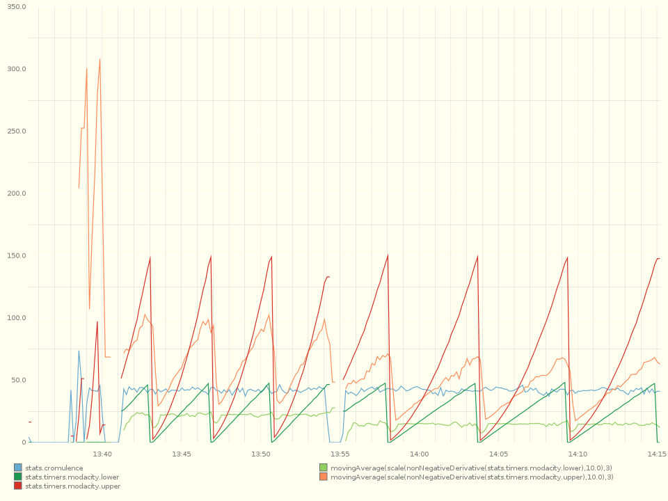

# graphite chef cookbook

Installs/Configures graphite.

To test, run the dashboard server locally:

    sudo foreman start dashboard -f /etc/graphite/Procfile 

Spin up a statsd (see the statsd cookbook, or run `cd $statsd_dir ; node stats.js exampleConfig.js`), and bombard it with metrics:

    ruby -r /usr/local/share/statsd/examples/ruby_example.rb  -e 'PER_SEC=100 ; RESET= PER_SEC * 300 ; Statsd.configure("localhost", 8125); count = RESET/2; loop do ; cromulence = rand * 1.9 ; modacity = (50 * (count.to_f/RESET)) + 100*rand*((count.to_f/RESET)**2) ; puts [Time.now, count, modacity, cromulence].join("\t") if (count % PER_SEC) == 0; Statsd.increment("cromulence", cromulence) ; Statsd.timing("modacity", modacity) ; sleep(2 * rand / PER_SEC.to_f) ; count = (count + 1) % RESET ; end' > /tmp/cromulacity.log &
    tail -f /var/log/{statsd,graphite/*}/current

The results will appear in the dashboard metric panel on the left. You can set up your own dashboards by referring to the image on the page directly (modify the port/ip as appropriate):

    http://33.33.33.30:5100/render/?from=-12minutes
    &width=960&height=720
    &yMin=&yMax=
    &colorList=67A9CF,91CF60,1A9850,FC8D59,D73027
    &bgcolor=FFFFF0
    &fgcolor=808080
    &target=stats.cromulence
    &target=movingAverage(scale(nonNegativeDerivative(stats.timers.modacity.lower)%2C10)%2C3)
    &target=stats.timers.modacity.lower
    &target=movingAverage(scale(nonNegativeDerivative(stats.timers.modacity.upper)%2C10)%2C3)
    &target=stats.timers.modacity.upper

You'll see the cromulence is steady with slight wiggle; the lower-bound modacity ramps linearly, while its upper bound ramps quadratically, resetting every 5 minutes:

* Cookbook source:   [http://github.com/infochimps-cookbooks/graphite](http://github.com/infochimps-cookbooks/graphite)
* Ironfan tools: [http://github.com/infochimps-labs/ironfan](http://github.com/infochimps-labs/ironfan)
* Homebase (shows cookbook in use): [http://github.com/infochimps-labs/ironfan-homebase](http://github.com/infochimps-labs/ironfan-homebase)

## Overview

Installs and configures [Graphite](http://graphite.wikidot.com/)

`recipe[graphite]` should build a stand-alone Graphite installation.

`recipe[graphite::ganglia]` integrates with Ganglia. You'll want at least one
monitor node (i.e. `recipe[ganglia]`) node to be running to use it.

#### CAVEATS:

I didn't see an easy way to set Graphite's credentials easily.  I set those to
root/root with an email address going no where.

Ships with two default schemas, stats.* (for Etsy's statsd) and a catchall that
matches anything. The catchall retains minutely data for 13 months, as in the
default config. stats retains data every 10 seconds for 6 hours, every minute
for a week, and every 10 minutes for 5 years.

## Recipes 

* `carbon`                   - Carbon
* `default`                  - Base configuration for graphite
* `ganglia`                  - Ganglia
* `dashboard`                - Web Dashboard
* `whisper`                  - Whisper

## Integration

Supports platforms: debian and ubuntu

Cookbook dependencies:

* python
* apache2
* runit
* ganglia
* install_from
* silverware

## Attributes

## License and Author

Author::                Heavy Water Software Inc. (<darrin@heavywater.ca>)
Copyright::             2011, Heavy Water Software Inc.

Licensed under the Apache License, Version 2.0 (the "License");
you may not use this file except in compliance with the License.
You may obtain a copy of the License at

    http://www.apache.org/licenses/LICENSE-2.0

Unless required by applicable law or agreed to in writing, software
distributed under the License is distributed on an "AS IS" BASIS,
WITHOUT WARRANTIES OR CONDITIONS OF ANY KIND, either express or implied.
See the License for the specific language governing permissions and
limitations under the License.

> readme generated by [ironfan](http://github.com/infochimps-labs/ironfan)'s cookbook_munger
